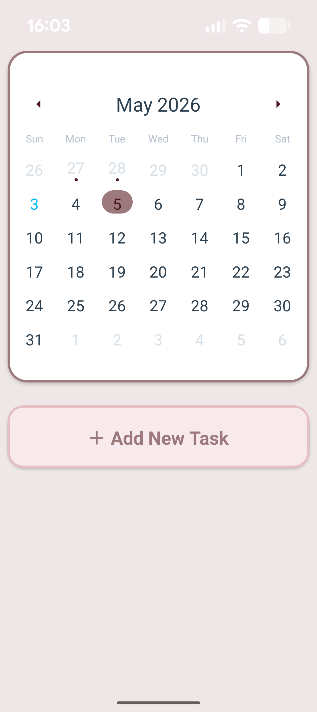
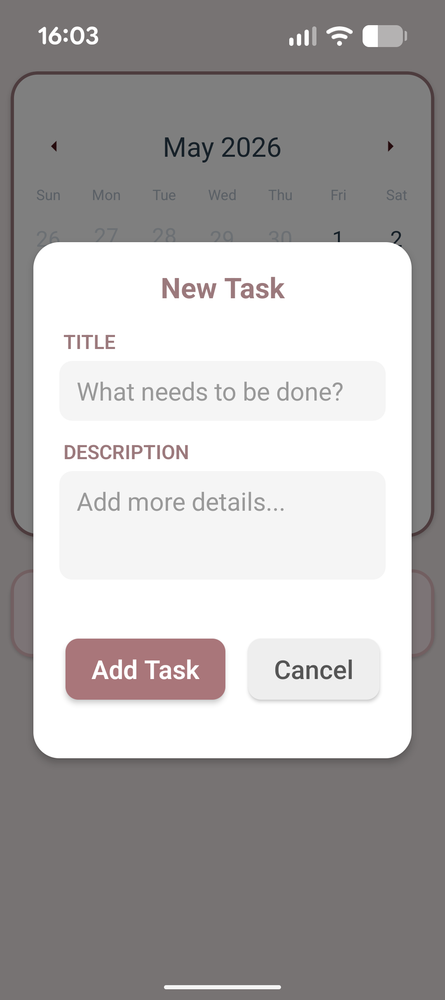

# Einotes 

A React Native note-taking app.
Notes are stored locally on device and automatically backed up to Firestore,
so your data is safe across devices and reinstalls.

## Screenshots

<p float="left">
  
  
</p>

## Features

- **Calendar view** - full-screen calendar with dot indicators on days that have notes
- **Daily notes** - add notes with a title and description under any day
- **Local-first storage** - data lives on your device for fast, offline access
- **Firestore backup** - notes are synced to the cloud and restored on login
- **Authentication** - sign in with Google or Email via Firebase Auth

## Tech Stack

- React Native
- Firebase Auth (Google + Email)
- Cloud Firestore
- Async Storage

## Installation

```bash
git clone https://github.com/annaadar/einotes
cd einotes
pnpm install
pnpm start
```

> Requires a Firebase project with Authentication and Firestore enabled.
> Add your `google-services.json` (Android) and `GoogleService-Info.plist` (iOS) before running.
